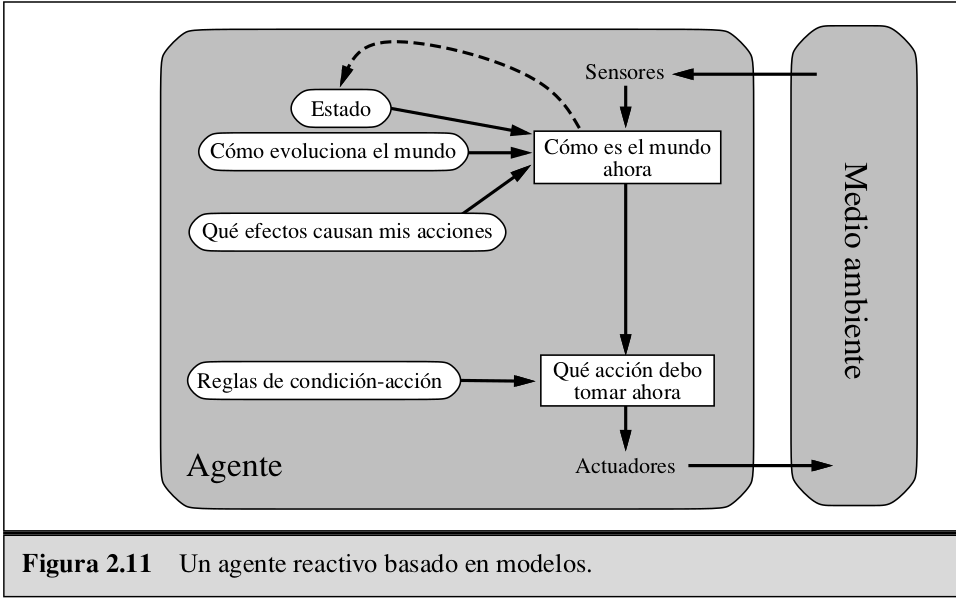

### 1.Especificación do contorna de tarefas
Contorno de tarefas | Observable| Axentes | Determinista | Episódico | Estático | Discreto | Coñecido
:---: | :---: | :---: | :---: | :---: | :---: | :---: | :---: |
 RPS | Parcialmnete | Multi | Determinista | Secuencial | Estático | Discreto  |  Conocido |

Parcialmente observable: No podemos saber con certeza que va a sacar el otro jugador.

Multiagente: hay un agente máquina y un agente humano.

Determinista: Dependiendo de cual sea la jugada que más haya usado el agente humano en una cantidad determinada de partidas, el agente máquina deduce cual puede ser la siguiente acción del humano. Por tanto, las acciones de la máquina están determinadas por las del humano.

Secuencial: Las acciones del jugador influirán en las futuras de la máquina.

Estático: El entorno no cambia con el paso del tiempo.

Discreto: El piedra, papel, tijeras solo tiene tres estados distintos.

Conocido: Ambos agentes conocen las reglas del juego.

### 2.Identificación do tipo de axente e estrutura

Cómo es el mundo ahora: Que ha sacado el agente humano, piedra, papel o tijeras.

Reglas de condición - acción: Sacar piedra o papel o tijeras según la acción que más veces haya realizado el humano en un número determinado de partidas.

Qué acción debo tomar ahora: Decidir que sacar.

Qué efectos causan mis acciones: Dependiendo de lo que saque en cada partida, puedo ganar, empatar o perder.

Cómo evoluciona el mundo: El número de veces que el humano ha realizado alguna de las tres acciones posibles por partida aumenta.

Estado: Número de veces que el humano ha sacado piedra, papel o tijeras.

### 3.Implementación en Python

### 4.Extensión ao RPS + Lizard Spock

